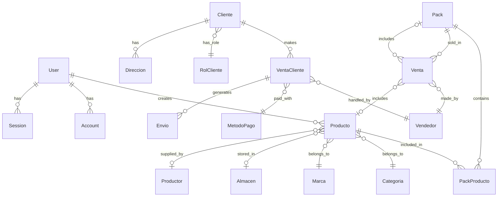

# Especificación de Software - GOXA Platform

**Versión:** 1.0  
**Fecha:** 2024-12-19  
**Autor:** Equipo de Desarrollo GOXA

---

## 1. Resumen Ejecutivo

### 1.1 Descripción General
GOXA es una plataforma integral que combina funcionalidades de ERP (Enterprise Resource Planning), E-commerce y CRM (Customer Relationship Management) para optimizar la gestión empresarial. La plataforma está diseñada específicamente para empresas que manejan productos naturales y gourmet, con un enfoque especial en mieles, productos de Oxapampa, carnes, chorizos para parrilla y orquídeas.

### 1.2 Propósito
- Unificar la gestión empresarial, comercio electrónico y relaciones con clientes en un solo ecosistema digital
- Optimizar procesos operativos y mejorar la visibilidad en tiempo real del negocio
- Facilitar la gestión de inventario, ventas, comisiones y seguimiento de clientes
- Proporcionar una experiencia de usuario moderna y responsive

### 1.3 Alcance
La plataforma incluye tres módulos principales:
- **Módulo ERP**: Gestión de inventario, productos, ventas y finanzas
- **Módulo E-commerce**: Tienda en línea con catálogo de productos y proceso de compra
- **Módulo CRM**: Gestión de clientes, vendedores y seguimiento de oportunidades

---

## 2. Arquitectura Técnica

### 2.1 Stack Tecnológico

#### Frontend
- **Framework**: Next.js 15.3.0 (React 18.2.0)
- **Lenguaje**: TypeScript 5
- **Estilos**: Tailwind CSS 3.3.0
- **UI Components**: Radix UI + shadcn/ui
- **Animaciones**: Framer Motion 12.7.2
- **Formularios**: React Hook Form 7.55.0 + Zod 3.24.2

#### Backend
- **API**: Next.js API Routes
- **GraphQL**: Apollo Server 4.12.0 + GraphQL Yoga 5.13.3
- **Base de Datos**: PostgreSQL con Prisma ORM 6.6.0
- **Autenticación**: NextAuth.js 4.24.11
- **Validación**: Zod 3.24.2

#### Herramientas de Desarrollo
- **Linting**: ESLint + TypeScript ESLint
- **Build**: Next.js Build System
- **Base de Datos**: Prisma Migrate
- **Deployment**: Optimizado para Vercel

### 2.2 Estructura de la Base de Datos

#### Entidades Principales
- **User**: Usuarios del sistema con roles (ADMIN, USER, VENDOR, MARKETING, INVENTORY, FINANCE)
- **Producto**: Productos con SKU, precios, stock, categorías, marcas
- **Pack**: Agrupaciones de productos con precios especiales
- **Cliente**: Clientes con roles (Retail, Mayorista) y direcciones
- **Venta**: Registro de ventas con comisiones y seguimiento
- **Vendedor**: Vendedores con tracking de ventas y comisiones
- **Categoria/Marca**: Clasificación de productos
- **Almacen/Productor**: Gestión de ubicaciones y proveedores

#### Enums de Negocio
- **TipoProducto**: CORE, NO_CORE
- **UnidadDeVenta**: PESO, UNIDAD
- **Presentacion**: VIDRIO, PLANTA, EMPAQUETADO
- **UnidadMedida**: GR, KG, ML, UNIDAD

---

## 3. Funcionalidades por Módulo

### 3.1 Módulo ERP

#### Gestión de Productos
- **CRUD de Productos**: Crear, leer, actualizar y eliminar productos
- **Atributos del Producto**:
  - SKU único
  - Nombre y descripción
  - Precio y margen de comisión
  - Tipo (Core/No Core)
  - Unidad de venta (Peso/Unidad)
  - Presentación (Vidrio/Planta/Empaquetado)
  - Contenido y unidad de medida
  - Stock actual y mínimo
  - Imagen del producto
  - Categoría y marca
  - Almacén y productor asociados

#### Gestión de Inventario
- **Control de Stock**: Monitoreo en tiempo real del inventario
- **Alertas de Stock Bajo**: Notificaciones automáticas cuando el stock está por debajo del mínimo
- **Ajustes de Inventario**: Registro de movimientos de stock
- **Gestión de Almacenes**: Múltiples ubicaciones de almacenamiento
- **Tracking de Productores**: Seguimiento de proveedores y productores

#### Gestión de Ventas
- **Registro de Ventas**: Captura de transacciones con productos o packs
- **Control de Comisiones**: Cálculo automático de comisiones por vendedor
- **Seguimiento de Vendedores**: Dashboard de rendimiento por vendedor
- **Reportes de Ventas**: Análisis de ventas diarias, mensuales y anuales

#### Gestión de Packs
- **Creación de Packs**: Agrupación de productos con precios especiales
- **Configuración de Cantidades**: Definición de cantidades por producto en cada pack
- **Precios Especiales**: Descuentos aplicados a los packs

### 3.2 Módulo E-commerce

#### Catálogo de Productos
- **Visualización de Productos**: Grid responsive con imágenes y precios
- **Filtros Avanzados**: Por categoría, precio, marca, disponibilidad
- **Búsqueda**: Funcionalidad de búsqueda por nombre, SKU o descripción
- **Paginación**: Navegación eficiente a través del catálogo
- **Categorización**: Organización por categorías y subcategorías

#### Proceso de Compra
- **Carrito de Compras**: Gestión de productos seleccionados
- **Validación de Stock**: Verificación de disponibilidad en tiempo real
- **Cálculo de Totales**: Precios, descuentos, impuestos y envío
- **Checkout**: Proceso de finalización de compra
- **Métodos de Pago**: Integración con pasarelas de pago

#### Gestión de Clientes
- **Registro de Clientes**: Creación de cuentas de usuario
- **Perfiles de Cliente**: Información personal y preferencias
- **Historial de Compras**: Seguimiento de pedidos anteriores
- **Direcciones**: Gestión de múltiples direcciones de envío
- **Roles de Cliente**: Retail y Mayorista con descuentos diferenciados

### 3.3 Módulo CRM

#### Gestión de Clientes
- **Base de Datos de Clientes**: Información completa de contactos
- **Segmentación**: Clasificación por roles y comportamiento
- **Historial de Interacciones**: Registro de comunicaciones y actividades
- **Seguimiento de Oportunidades**: Pipeline de ventas y leads

#### Gestión de Vendedores
- **Perfiles de Vendedores**: Información y configuración de vendedores
- **Tracking de Ventas**: Seguimiento de rendimiento y comisiones
- **Dashboard de Vendedores**: Métricas y KPIs individuales
- **Asignación de Clientes**: Gestión de carteras de clientes

#### Reportes y Analytics
- **Dashboard Ejecutivo**: Métricas clave del negocio
- **Reportes de Ventas**: Análisis detallado por período
- **Análisis de Inventario**: Rotación y tendencias de productos
- **Reportes de Comisiones**: Cálculo y seguimiento de comisiones

### 3.4 Sistema de Autenticación y Autorización

#### Autenticación
- **Login/Registro**: Sistema de autenticación con credenciales
- **NextAuth.js**: Integración con múltiples proveedores
- **Gestión de Sesiones**: Control de sesiones activas
- **Recuperación de Contraseña**: Flujo de reset de contraseñas

#### Autorización
- **Sistema de Roles**: USER, ADMIN, VENDOR, MARKETING, INVENTORY, FINANCE
- **Control de Acceso**: Restricciones basadas en roles
- **Middleware de Protección**: Validación de rutas protegidas
- **Auditoría**: Registro de accesos y cambios

---

## 4. Características Técnicas

### 4.1 Rendimiento
- **Server-Side Rendering (SSR)**: Optimización de carga inicial
- **Static Site Generation (SSG)**: Páginas estáticas para mejor rendimiento
- **Image Optimization**: Optimización automática de imágenes con Next.js
- **Code Splitting**: Carga lazy de componentes
- **Caching**: Estrategias de caché para APIs y datos

### 4.2 Escalabilidad
- **Arquitectura Modular**: Separación clara de responsabilidades
- **API RESTful**: Endpoints bien definidos y documentados
- **GraphQL**: Consultas eficientes y flexibles
- **Base de Datos Optimizada**: Índices y relaciones optimizadas
- **Microservicios**: Preparado para descomposición futura

### 4.3 Seguridad
- **Autenticación Segura**: Hashing de contraseñas con bcrypt
- **Validación de Datos**: Validación robusta con Zod
- **Protección CSRF**: Tokens de protección contra ataques
- **Sanitización**: Limpieza de inputs del usuario
- **HTTPS**: Comunicación encriptada

### 4.4 Usabilidad
- **Responsive Design**: Adaptable a todos los dispositivos
- **Accesibilidad**: Cumplimiento de estándares WCAG
- **UX Moderna**: Interfaz intuitiva y atractiva
- **Navegación Intuitiva**: Estructura clara y lógica
- **Feedback Visual**: Estados de carga y confirmaciones

---

## 5. Requisitos del Sistema

### 5.1 Requisitos Funcionales

#### RF-001: Gestión de Productos
- El sistema debe permitir crear, leer, actualizar y eliminar productos
- Cada producto debe tener un SKU único
- Los productos deben soportar venta por peso o por unidad
- El sistema debe calcular automáticamente las comisiones

#### RF-002: Control de Inventario
- El sistema debe mantener el stock actualizado en tiempo real
- Debe generar alertas cuando el stock esté por debajo del mínimo
- Debe permitir ajustes manuales de inventario
- Debe rastrear movimientos de stock

#### RF-003: Proceso de Ventas
- El sistema debe registrar todas las ventas
- Debe calcular comisiones automáticamente
- Debe actualizar el stock tras cada venta
- Debe generar reportes de ventas

#### RF-004: E-commerce
- El sistema debe mostrar un catálogo de productos
- Debe permitir filtros y búsqueda
- Debe gestionar carritos de compra
- Debe procesar pagos

#### RF-005: Gestión de Usuarios
- El sistema debe soportar múltiples roles
- Debe controlar el acceso basado en roles
- Debe permitir registro y autenticación
- Debe mantener sesiones seguras

### 5.2 Requisitos No Funcionales

#### RNF-001: Rendimiento
- El sistema debe cargar páginas en menos de 3 segundos
- Debe soportar al menos 100 usuarios concurrentes
- Debe tener un tiempo de respuesta de API menor a 500ms

#### RNF-002: Disponibilidad
- El sistema debe tener una disponibilidad del 99.5%
- Debe implementar estrategias de backup
- Debe tener planes de recuperación ante desastres

#### RNF-003: Seguridad
- Debe encriptar contraseñas con bcrypt
- Debe validar todos los inputs
- Debe implementar protección CSRF
- Debe usar HTTPS en producción

#### RNF-004: Escalabilidad
- Debe soportar crecimiento de datos
- Debe permitir escalado horizontal
- Debe optimizar consultas de base de datos

---

## 6. Arquitectura de Datos

### 6.1 Modelo de Datos Principal

### 6.2 Flujo de Datos

1. **Creación de Productos**: Admin → Producto → Base de Datos
2. **Proceso de Venta**: Cliente → Carrito → Venta → Actualización de Stock
3. **Gestión de Inventario**: Admin → Ajustes → Stock → Alertas
4. **Reportes**: Sistema → Agregación → Dashboard → Usuario

---

## 7. API y Endpoints

### 7.1 REST API

#### Autenticación
- `POST /api/auth/register` - Registro de usuarios
- `POST /api/auth/signin` - Inicio de sesión
- `POST /api/auth/token` - Renovación de tokens

#### Productos
- `GET /api/admin/products` - Listar productos
- `POST /api/admin/products` - Crear producto
- `GET /api/admin/products/[id]` - Obtener producto
- `PUT /api/admin/products/[id]` - Actualizar producto
- `DELETE /api/admin/products/[id]` - Eliminar producto
- `POST /api/admin/products/import` - Importar productos

#### Inventario
- `GET /api/admin/inventory` - Estado del inventario
- `POST /api/admin/inventory/adjust` - Ajustar inventario

#### Estadísticas
- `GET /api/admin/stats` - Estadísticas del dashboard

### 7.2 GraphQL API

#### Queries
- `products` - Listar productos con filtros
- `categories` - Obtener categorías
- `brands` - Obtener marcas
- `dashboardData` - Datos del dashboard

#### Mutations
- `createProduct` - Crear producto
- `updateProduct` - Actualizar producto
- `deleteProduct` - Eliminar producto
- `adjustInventory` - Ajustar inventario

---

## 8. Interfaz de Usuario

### 8.1 Diseño Responsive
- **Mobile First**: Diseño optimizado para dispositivos móviles
- **Breakpoints**: sm (640px), md (768px), lg (1024px), xl (1280px)
- **Grid System**: CSS Grid y Flexbox para layouts flexibles

### 8.2 Componentes UI
- **Design System**: Basado en shadcn/ui y Radix UI
- **Tema**: Colores, tipografías y espaciado consistentes
- **Accesibilidad**: Componentes accesibles por defecto
- **Animaciones**: Transiciones suaves con Framer Motion

### 8.3 Navegación
- **Sidebar**: Navegación principal en el dashboard
- **Breadcrumbs**: Navegación contextual
- **Menú Responsive**: Adaptable a diferentes tamaños de pantalla

---

## 9. Despliegue y DevOps

### 9.1 Entornos
- **Desarrollo**: Local con hot reload
- **Staging**: Entorno de pruebas
- **Producción**: Despliegue en Vercel

### 9.2 Base de Datos
- **Desarrollo**: PostgreSQL local
- **Producción**: PostgreSQL en la nube
- **Migraciones**: Prisma Migrate para versionado

### 9.3 Variables de Entorno
- `DATABASE_URL` - URL de conexión a la base de datos
- `NEXTAUTH_SECRET` - Secreto para NextAuth
- `NEXTAUTH_URL` - URL base de la aplicación

---

## 10. Roadmap y Futuras Mejoras

### 10.1 Fase 1 (Actual)
- ✅ Sistema de autenticación
- ✅ Gestión básica de productos
- ✅ Dashboard administrativo
- ✅ Interfaz de e-commerce básica

### 10.2 Fase 2 (Próximas 3-6 meses)
- 🔄 Integración de pasarelas de pago
- 🔄 Sistema de notificaciones
- 🔄 Reportes avanzados
- 🔄 API móvil

### 10.3 Fase 3 (6-12 meses)
- 📋 Integración con sistemas externos
- 📋 IA para recomendaciones
- 📋 Analytics avanzados
- 📋 Multi-tenancy

---

## 11. Conclusión

GOXA Platform representa una solución integral para empresas que buscan unificar sus procesos de gestión empresarial, comercio electrónico y relaciones con clientes. Con una arquitectura moderna, escalable y segura, la plataforma está diseñada para crecer junto con el negocio y adaptarse a las necesidades cambiantes del mercado.

La combinación de tecnologías modernas como Next.js, TypeScript, Prisma y PostgreSQL, junto con un diseño centrado en el usuario, posiciona a GOXA como una herramienta poderosa para la gestión empresarial en el sector de productos naturales y gourmet.

---

**Documento generado automáticamente el 19 de diciembre de 2024**
